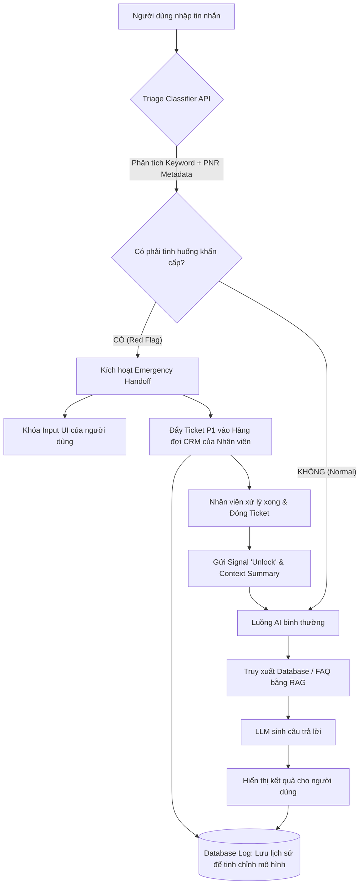

# demo.md — Demo kiến trúc dữ liệu

Tài liệu này minh họa kiến trúc **Triage Router** nhằm phát hiện và định tuyến các câu hỏi khẩn cấp (như sắp đóng gate, lỡ chuyến) thẳng đến hệ thống CRM của nhân viên trực để xử lý rủi ro **T-01**.

---

## 1. Sơ đồ cách hệ thống xử lý

Sơ đồ dưới đây thể hiện luồng dữ liệu đi qua bộ phân loại trước khi quyết định gọi LLM hay đẩy cho con người:

---

## 2. Thành phần chính

| Thành phần | Nhận gì? | Làm gì? | Trả ra gì? |
|---|---|---|---|
| **Triage Classifier** | Văn bản người dùng + Metadata từ PNR | Đánh giá mức độ khẩn cấp bằng quy tắc (Rule-based) hoặc mô hình phân loại nhẹ. | Cờ trạng thái: `URGENT` hoặc `NORMAL`. |
| **Routing Logic** | Cờ trạng thái từ Classifier | Quyết định định tuyến dữ liệu: Bypass LLM hay tiếp tục luồng RAG. | Lệnh kích hoạt Handoff hoặc Lệnh gọi luồng AI. |
| **Hàng đợi CRM** | Ticket cảnh báo `URGENT` | Đẩy yêu cầu hỗ trợ vào màn hình nhân viên trực sân bay với mức ưu tiên cao nhất (P1). | Thông tin vị trí hàng đợi cho giao diện người dùng. |
| **Logging DB** | Lịch sử chat + Kết quả phân loại | Lưu trữ dữ liệu để hậu kiểm và cải thiện tỷ lệ nhận diện đúng của Classifier. | Dataset phục vụ tinh chỉnh (Fine-tuning). |

---

## 3. Khi hệ thống gặp vấn đề

| Khi nào lỗi xảy ra? | Hệ thống làm gì (Fallback)? | Người dùng thấy gì? |
|---|---|---|
| **Classifier bị lỗi/chậm** | Router tự động chuyển request vào luồng AI bình thường. Lớp **Chỉ dẫn AI** sẽ đóng vai trò bảo vệ dự phòng để ngắt lời. | AI vẫn trả lời, nhưng nếu nhận thấy từ khóa khẩn cấp, AI sẽ tự gọi lệnh chuyển máy. |
| **CRM của nhân viên quá tải** | Hệ thống giữ ticket ở trạng thái ưu tiên cao nhất cho đến khi có nhân viên trống. | Giao diện hiện thông báo: "Mọi tư vấn viên đang bận, vị trí của bạn là #1. Vui lòng giữ máy." |
| **Đánh dấu nhầm (False Positive)** | Nhân viên tiếp nhận phát hiện khách không thực sự gấp, bấm nút "Trả về luồng Bot". | Màn hình chat mở khóa, AI tiếp tục hỗ trợ khách tra cứu thông tin bình thường. |

---

## 4. Kiểm tra nhanh

- [x] Có bước kiểm tra phân loại (Triage) ngay từ đầu để tiết kiệm thời gian.
- [x] Có cơ chế bỏ qua AI (Bypass LLM) khi gặp tình huống khẩn cấp.
- [x] Có luồng kết nối trực tiếp với CRM của nhân viên.
- [x] Có cơ chế ghi log để theo dõi và sửa lỗi lặp lại.